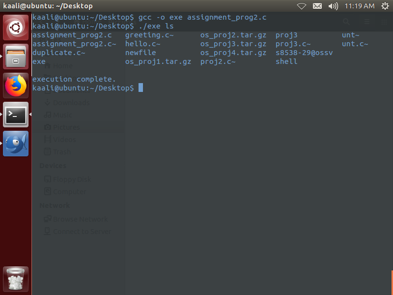
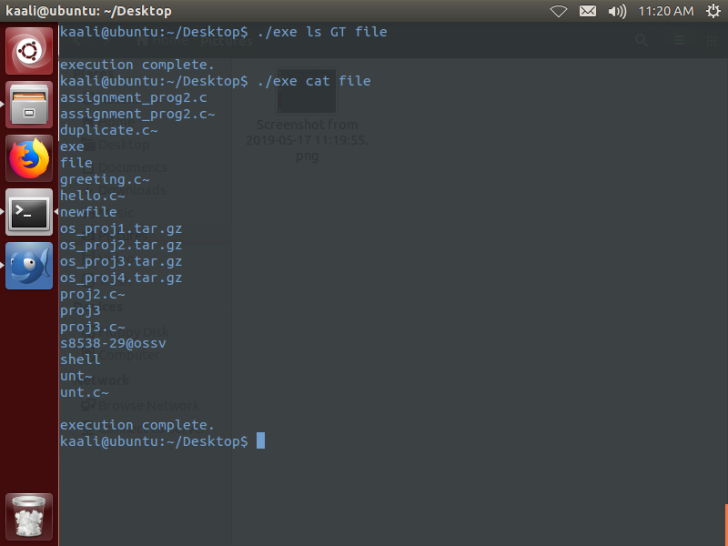
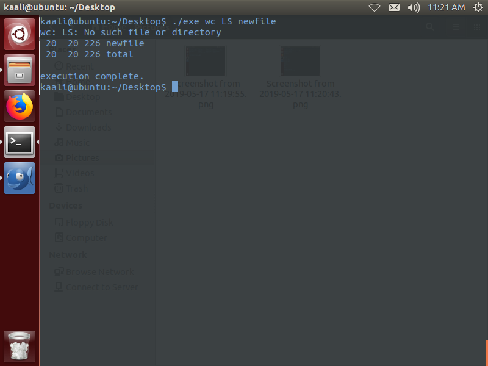
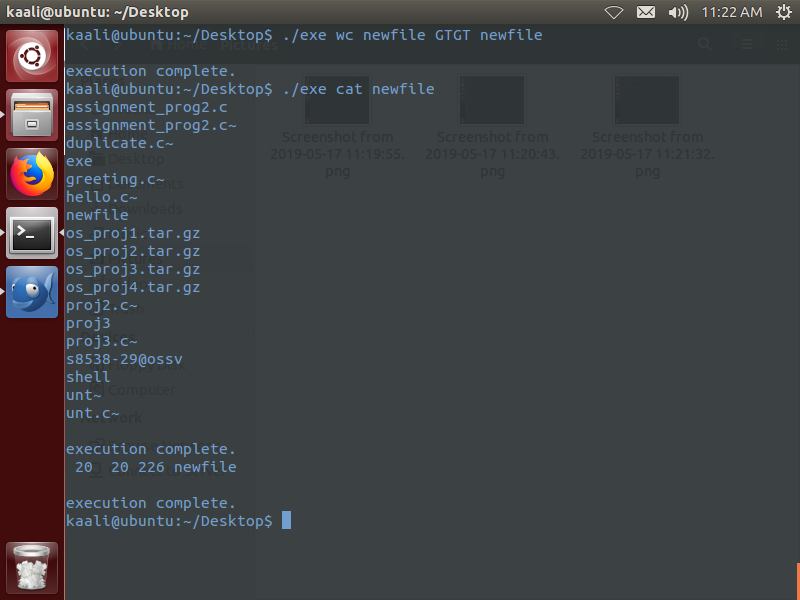
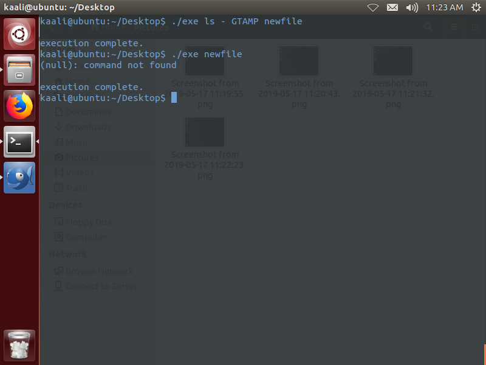
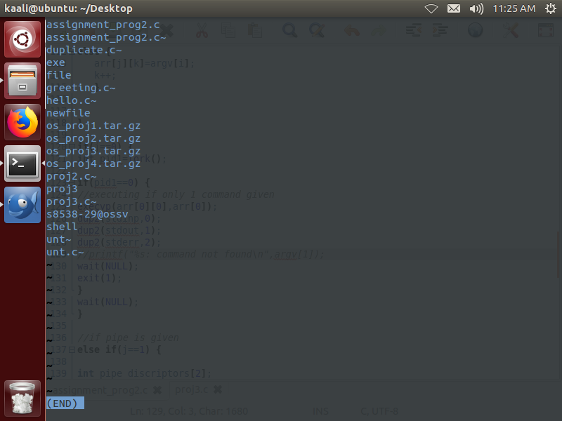
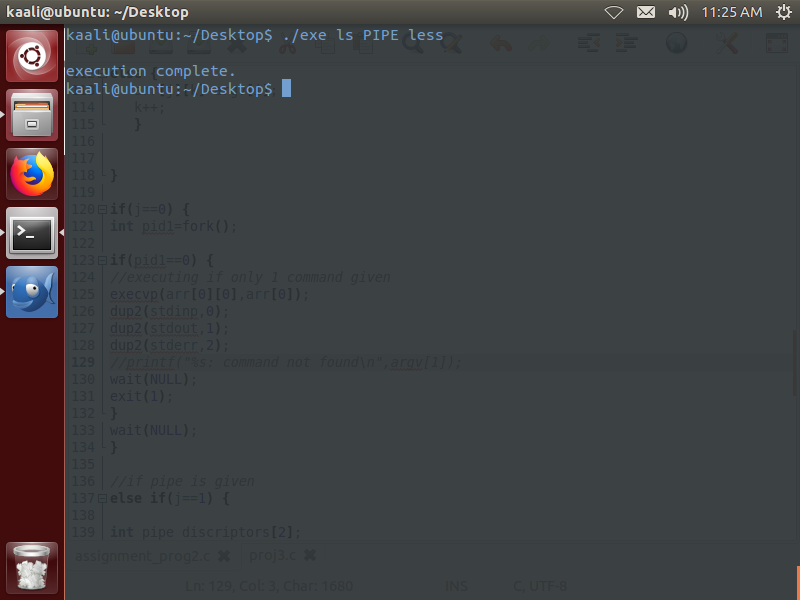

# Comand-Line-Interpreter

For	this project,	we	implement	a	program	which	will	execute	a	given	
command(s)	as	command	line	arguments	to	the	program.	is	supports	
input,	output	and	error	redirection	and	pipes.	However,	instead	of	using	the	
symbols	used	by	the	shell,	it	will	use	the	following	symbols:
LT for <
GT for >
GTGT for >>
GTAMP for >&
PIPE for |

Some	examples	are	given	below (the	corresponding	shell	command	is	given	first,	
followed	by	the	project	3	command	which	gives the	same	result): 
Shell	Command:	 $	ls  
Project	3: $	./proj3	silent	ls 
Shell	Command: $	ls	-al 
Project	3: $./proj3	silent	ls	–al 
Shell	Command: $	ls	>	out 
Project	3: $./proj3	silent	ls	GT	out 
Shell	Command: $	ls	>>	out 
Project	3: $./proj3	silent	ls	GTGT	out 
Shell	Command: $	wc	<	input	>	output 
Project	3: $./proj3	silent	wc	LT	input	GT	out 
Shell Command: $	ls	>&	out 
Project	3: $./proj3	silent	ls	GTAMP	out 
Shell	Command: $	ls	|	wc 
Project	3: $./proj3	silent	ls	PIPE	wc 
Shell	Command: $	ls	|	wc	|	wc	>	out 
Project	3: $./proj3	silent	ls	PIPE	wc	PIPE	wc	GT	out	 

A	few	test	runs :

$		./proj3	silent	ls 
makefile		out		proj3		proj3.c		proj3.o 
Command(s)	execution	complete. 
$	./proj3	silent	ls	PIPE	wc 
					5							5						35 
Command(s)	execution	complete. 
$	./proj3	verbose	ls	PIPE	wc 
					5							5						35 
ls								:	23533 
wc								:	23534 
Command(s)	execution	complete.

